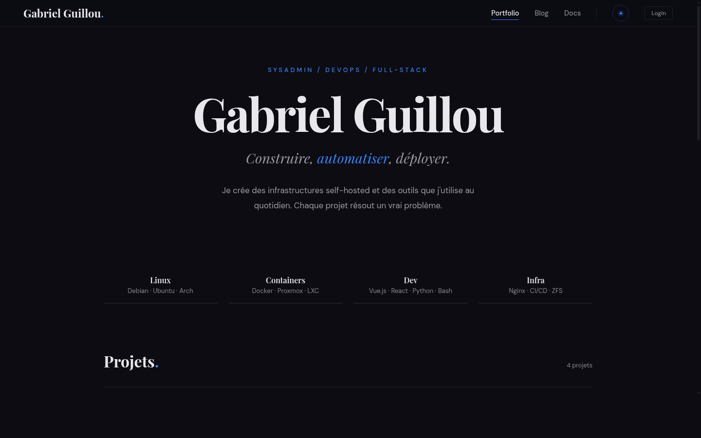
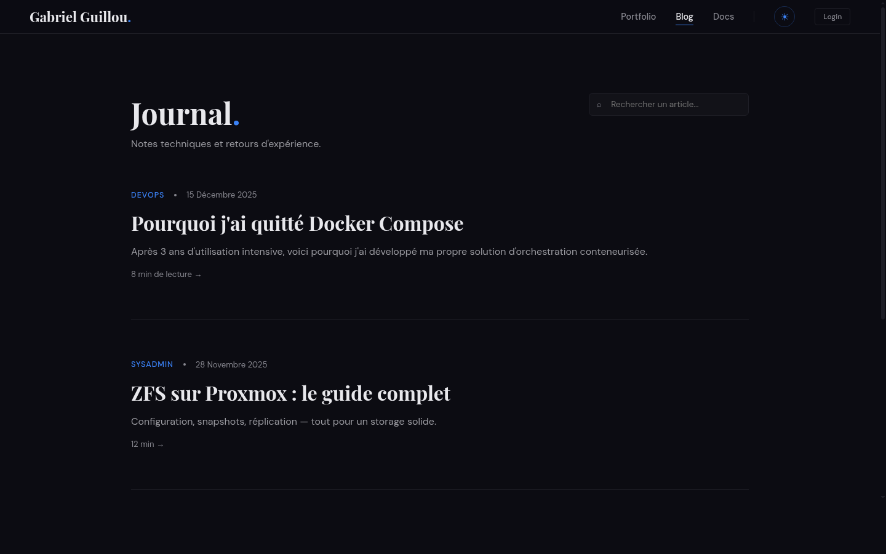
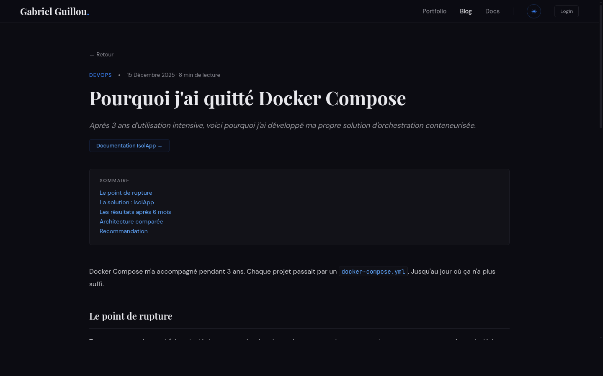
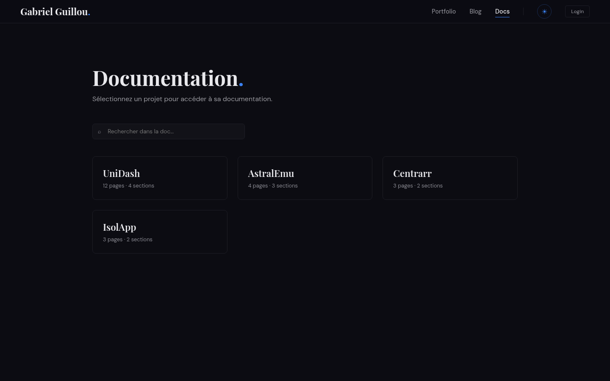

# Portfolio — Gabriel Guillou

Personal portfolio, blog, and technical documentation site built with Astro SSR.

> **All data shown is placeholder test data.**
> The articles, projects, documentation pages, and personal information displayed on this site are fictional and only serve to demonstrate the application's features. Nothing reflects real projects or real information.

## Screenshots

### Portfolio



### Blog



### Article



### Docs Reader


### Docs Selector



## Stack

- **Astro** (SSR, Node adapter) — server-rendered pages, React islands for interactivity
- **React 19** — interactive components (ThemeToggle, SearchBar, editors)
- **Drizzle ORM** + **SQLite** (better-sqlite3) — embedded database
- **Marked** + **Shiki** — Markdown rendering with syntax highlighting
- **Mermaid** — diagrams in articles and documentation
- **Docker** — production deployment

## Features

- Portfolio page with YAML frontmatter (skills, projects, stats)
- Blog with categories, client-side search, and draft/publish system
- Multi-project documentation with 3-column layout and search
- MDX editor with toolbar, syntax highlighting, and live preview
- Visual YAML editor for portfolio data (skills, projects, stats)
- Edit history with restore capability
- Visibility system (hide/show articles and pages)
- Maintenance mode (admin only)
- Dark/light theme with automatic detection
- Session-based admin authentication
- Responsive design with burger menu (800px breakpoint)
- Self-hosted fonts (DM Sans, Playfair Display, JetBrains Mono)
- Drag & drop reordering for articles, sections, and pages

## Getting Started

```bash
# Install dependencies
npm install

# Generate and run DB migrations
npm run db:generate
npm run db:migrate

# Seed the database with test data
npm run seed

# Start dev server
npm run dev
```

The site is available at `http://localhost:4321`.

## Environment Variables

| Variable | Description | Default |
|---|---|---|
| `ADMIN_PASSWORD` | Admin password | `admin` |
| `SESSION_SECRET` | Session cookie secret | auto-generated |
| `DATABASE_URL` | Path to SQLite database | `./data/portfolio.db` |

## Docker

```bash
docker compose up -d
```

The container exposes port `4321`.

## Project Structure

```
src/
  components/    # Astro components + React islands
  db/            # Drizzle schema, migrations, seed
  layouts/       # BaseLayout
  lib/           # Utilities (markdown, auth)
  pages/
    api/         # REST routes (CRUD posts, docs, portfolio, auth)
    admin/       # Admin pages
    blog/        # Blog list + articles
    docs/        # Documentation (selector + 3-column reader)
  styles/        # Global CSS + editor styles
doc/             # Specs and reference prototype
```

## License

Personal project, source code is not open-source.
